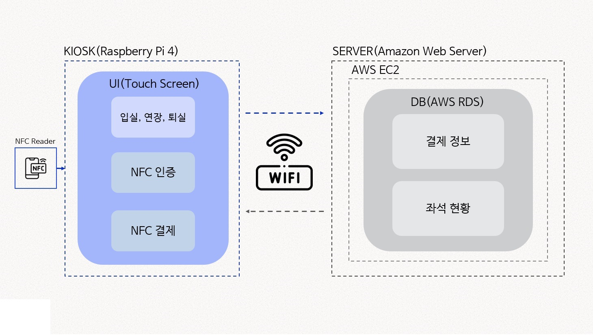

# 📘 HELPIOSK 스터디 카페 키오스크

2022 군산대학교 IT 정보제어공학과 캡스톤 디자인  
클라우드 서비스와 NFC태그 결제를 이용한 키오스크  
---

* #### :family: 팀원
  * 정휘성, 김주하
  
* #### :computer: Kiosk
  * Language & Environment: Python
  * Pyqt5 / NFC Tag 
  * UI: Pyqt5 + CSS   
  * 개발 팀원: 정휘성
  
* #### :file_folder: Server
  * Language & Environment: DML, Mysql 
  * AWS EC2/RDS: DB Server
  * 개발 팀원:  김주하
  
  
* #### 💡 구동 환경
  * Raspberry Pi 4(4GB)
  * OS Ver: Stretch 
  * Touch Screen: KLEINZ KP1401FTM 14Inch Portable Display
  * RC522 NFC Reader
  * IDE: Pycharm, Thonny, Pyqt5 Designer, Mysql WorkBench

  
---


<!-------------------------------------------------------------Part 1------------------------------------------------------------------------------------------>

 ## 1. 블록도 설명

  

   
  
  

 1. __버튼 이벤트__  
    입실 버튼 터치 시 좌석 선택 후 원하는 요금제를 선택하게 되고 결제를 진행 함  
    * 1초마다 서버 내 잔여시간을 갱신하여 잔여시간이 없을 시에 퇴실 처리하게 됨 
    
    연장 버튼 터치 시 해당 좌석 인증 후 연장 요금제를 선택하게 되며 연장시간 결제를 진행 함
    * 결제완료 시 잔여시간에 구매시간을 더하여 서버에 저장 
    
    퇴실 버튼 터치 시 좌석 인증 후 퇴실처리가 됨
    * 서버에 저장 되었던 좌석 사용 유무를 변경하고 다른 사용자가 사용 할 수 있게 변경함
    
 2. __결제__    
    결제 버튼 터치 시 해당 좌석, 총 시간, 총 금액 확인 후 NFC Tag를 이용하여 결제 함
    * 서버에 NFC UID 및 결제 완료 정보를 DB서버에 저장 및 서버에 반영 함
     


 <!-------------------------------------------------------------Part 2------------------------------------------------------------------------------------------>
 ## 2. 개요
 1. __목표__
    * 무인 운영 24시간 사용 가능  
    * 대면을 원하지 않은 사용자 또한 사용 가능   
    * 대기시간 절감 효과
    * 리눅스 기반으로 윈도우 로열티 없음

 2. __키오스크 구동 화면__  
    
      
    <a href="https://youtu.be/jkgIGHYmFuQ" target="_blank">유튜브</a>
    
    
 3. __핵심 내용 설명__  
   
    NFC(Near Field Communication)  
    > 10 cm 이내의 근거리에서 무선 데이터를 주고받는 통신 기술  
    > 결제 및 도어락 등에 사용하고 있다

    AWS EC2(Elastic Compute Cloud)  
    >컴퓨팅 용량을 클라우드에서 제공하는 웹 서비스  
    >Linux / Windows 선택 가능  
    >머신러닝, 웹서버, 게임서버, 이미지 처리 등 다양한 용도에 최적화된 서버를 쉽게 구성 가능  

    Mysql  
    >관계형 데이터베이스 관리 시스템  
    >오픈소스, 다중 사용자 * 다중 스레드 지원  

 ---
  <!-------------------------------------------------------------Part 3------------------------------------------------------------------------------------------>
## 3.  코드 설명
### 입실 버튼 부분</br>
  * 다음과 같은 코드로 서버에 저장되어 있는 좌석을 키오스크에서 판별함  
  
       ```python
        conn = mc.connect(host=host, user=username, password=password, db=database, charset='utf8', port=port1)
        cur = conn.cursor()
        sql = "SELECT 좌석유무 FROM 테스트 WHERE 좌석번호 = %s"

        with conn:
            with conn.cursor() as cur:
                cur.execute(sql, (1,))  # n번 좌석의 좌석유무 확인
                result = cur.fetchall()

                for data in result:
                    if data == ('유',):
                        self.pButton_1.setText("1번 좌석\n사용중")
                        self.pButton_1.setStyleSheet("background-color: gainsboro")
                        self.pButton_1.setDisabled(True)
                    if data == ('무',):
                        self.pButton_1.setText("1번 좌석")
                        self.pButton_1.setStyleSheet("background-color:#eb9f9f")  # 기본 회색
                        self.pButton_1.clicked.connect(self.whktjr1)
             ..........

        def whktjr1(self):
             text1='1'
             self.sw=time_1(text1,'1')  # 시간제 선택 윈도우에 좌석 정보 보냄
             self.sw.exec_()
             self.hide() 
             self.second = time_1()  # 시간제 선택 윈도우로 전환 
             self.second.exec() 
             self.showMaximized()  

       ```
### 시간제 선택 부분</br>
  * 다음과 같은 코드로 선택된 아이템에 대한 시간과 가격을 계산함
  
       ```python 
        def item_clicked(self, item):
          self.item_selected.append(item)
          self.item_show()
          totaltime = int(self.totaltime.text())
          total = int(self.totalPrice.text())

          self.totaltime.setText(str(totaltime + ITEM_INFO[self.item_selected[-1]]['time']))
          self.totalPrice.setText(str(total + ITEM_INFO[self.item_selected[-1]]['price']))
       ```
   * 다음과 같은 코드로 좌석, 총 결제금액, 총 시간을 '결제 부분'으로 보냄  
  
       ```python 
        def item_pay(self):
           global pay_success
           #self.hide()
           paytime=int(self.totaltime.text())
           payprice =int(self.totalPrice.text())
           text1= int(self.label_s.text())

           if self.label_5.text() == '1':
               self.payto = paytoWindow(payprice,paytime,text1)
               self.payto.exec()
               pay_success = False
           elif self.label_5.text() == '2':
               self.exto = paytoex(payprice,paytime,text1)
               self.exto.exec()
               pay_success = False

          if pay_success:
              self.item_clearall()
          self.show()
       ```
### NFC 결제 부분</br>
  * 다음과 같은 코드로 시간제 선택 윈도우에서 받아온 정보를 결제창에서 출력
  
       ```python 
        self.label_Ttime.setText(f"{str(time)}시간")
        self.label_price.setText(f"{str(price)}원")
        self.label_seat.setText(f"{str(seat)}번 좌석")
       ```
   * 다음과 같은 코드로 NFC 정보를 받고 결제를 진행
  
       ```python 
        def card(self):
           global pay_success
           ret = QMessageBox.question(self, '결제 확인', '카드결제를 진행하시겠습니까?', QMessageBox.Yes | QMessageBox.No, QMessageBox.No)

           if ret == QMessageBox.Yes:
               QMessageBox.information(self,'알림', 'NFC 태그 해주세요')

               import RPi.GPIO as gpio
               from mfrc522 import SimpleMFRC522

               CardReader = SimpleMFRC522()

               id2, text = CardReader.read()
               random_user = id2
               pay_success = True


               if pay_success == True: #결제 완료 시
                   QMessageBox.information(self, '알림', '결제가 완료되었습니다')
                   conn = mc.connect(host=host, user=username, password=password, db=database, charset='utf8',
                                     port=3306) 
                   cur = conn.cursor()#서버에 접속

                   sql = "INSERT INTO 결제정보(사용자명, 좌석번호, 금액, 구매시간) VALUES(%s, %s, %s, %s)"
                   cur.execute(sql,(str(random_user), self.label_seat.text(), self.label_price.text(), self.label_Ttime.text(),)) 
                   # 서버에 결제 정보 저장

                   sql = "UPDATE 테스트 SET 좌석유무 = '유', 사용자명 = %s, 만료시간 =  DATE_ADD(NOW(), INTERVAL %s HOUR) WHERE 좌석번호 = %s"
                   cur.execute(sql, (str(random_user), self.label_Ttime.text(), self.label_seat.text(),)) # 서버에 좌석 정보 갱신
                   conn.commit()  
                   # 결제 완료 시 해당 좌석 정보를 사용중으로 바꾼다
                   
       ```
### NFC 인증 부분</br>
  * 다음과 같은 코드로 기존에 서버 저장된 사용자 UID와 인증하는 사용자 UID가 같으면</br>
    시간제 결제 창 또는 퇴실 되도록 서버 정보를 수정
  
       ```python 
        with conn:
          with conn.cursor() as cur:
              cur.execute(sql, (self.label_id2.text(),))  # n번 좌석의 사용자명 확인
              result = cur.fetchall()
              for data in result: 
                  if data == (str(random_user),): # 사용자 ID 확인
                     self.off = time_1(self.label_id2.text(), '2')
                     ...OR...
                     sql = "UPDATE 테스트 SET 좌석유무 = '무', 사용자명 = NULL, 만료시간 = NULL, 잔여시간 = NULL WHERE 좌석번호 = %s"
                     cur.execute(sql, (self.label_id.text(),))
                     conn.commit()  # 좌석 유무를 무로 바꾸고 결제 정보를 삭제 -> 퇴실시
                     
                     

       ```
 <!-------------------------------------------------------------Part 4------------------------------------------------------------------------------------------>
## 4. 서버 코드 설명
### DB 테이블 생성 부분</br>
   * 결제 정보를 저장하는 결제정보 테이블과 좌석 현황을 알려 주는 테스트 테이블을 생성
        ```SQL
        CREATE TABLE 테스트
        (
        좌석번호 INT(10) PRIMARY KEY, -- 기본키 설정
        좌석유무 CHAR(1) CHECK(좌석유무 = '유' OR 좌석유무 = '무'),
        사용자명 INT(20), # 기본 상태 NULL
        만료시간 DATETIME, # 기본 상태 NULL
        잔여시간 TIME # 기본 상태 NULL
        );
        
        CREATE TABLE 결제정보
        (
        사용자명 INT(20) NOT NULL,
        좌석번호 INT(10) NOT NULL,
        금액 INT(20) NOT NULL,
        구매시간 INT(10) NOT NULL,
        결제시간 DATETIME NOT NULL DEFAULT CURRENT_TIMESTAMP # 데이터가 삽입된 시간 삽입
        );
        ```
### 테스트 DB 초기 데이터 삽입 부분</br>
   * 존재하는 좌석 번호와 초기의 좌석 현황 내역을 삽입
        ```SQL
        insert into 테스트(좌석번호, 좌석유무) values ('1', '무');
        insert into 테스트(좌석번호, 좌석유무) values ('2', '무');
        insert into 테스트(좌석번호, 좌석유무) values ('3', '무');
        insert into 테스트(좌석번호, 좌석유무) values ('4', '무');
        insert into 테스트(좌석번호, 좌석유무) values ('5', '무');
        insert into 테스트(좌석번호, 좌석유무) values ('6', '무');
        insert into 테스트(좌석번호, 좌석유무) values ('7', '무');
        insert into 테스트(좌석번호, 좌석유무) values ('8', '무');
        insert into 테스트(좌석번호, 좌석유무) values ('9', '무');
        insert into 테스트(좌석번호, 좌석유무) values ('10', '무'); #각각의 좌석의 사용 유무를 '무'로 삽입
        ```
### 잔여 시간 갱신 부분</br>
   * 1초마다 진행하는 이벤트를 만들어서 1초마다 잔여 시간을 갱신
        ```SQL
        DROP EVENT IF EXISTS event_manage;
        CREATE EVENT event_manage
            ON SCHEDULE every 1 second #1초마다 갱신하는 이벤트
            STARTS current_timestamp() #만든 시간부터 이벤트 시작
            COMMENT '잔여 시간 갱신 이벤트'
            DO
              UPDATE 테스트 SET 잔여시간 = TIMEDIFF(만료시간, NOW()) WHERE 만료시간 IS NOT NULL;
        ```
### 시간 만료 시 좌석 현황 변경 부분</br>
   * 1초마다 진행하는 이벤트를 만들어서 1초마다 만료 시간을 파악하여 만료 시간일 시에</br>
     좌석 현황을 '무'로 수정하고, 사용자 명, 만료 시간, 잔여 시간을 NULL로 변경
        ```SQL
        DROP EVENT IF EXISTS event_manage2;
        CREATE EVENT event_manage2
           ON SCHEDULE every 1 second
           STARTS current_timestamp()
           COMMENT '1'
           DO
             UPDATE 테스트 SET 좌석유무 = '무', 잔여시간 = NULL, 만료시간 = NULL, 사용자명 = NULL WHERE 만료시간 = NOW();
        ```
        
        

 <!-------------------------------------------------------------Part 5------------------------------------------------------------------------------------------>
## 5. 문제점 및 향후 발전 계획
   * __처리 속도 문제__     
     > UI 폼이 열고 닫아질 때 속도가 늦어지는 문제
     > 라즈베리 파이보다 고사양의 싱글 보드 컴퓨터 또는 테스크톱을 사용해서 처리 속도를 높이는 방안  

   * __가상 결제 문제__    
     > NFC 결제 시 가상의 결제가 이루어지는 문제  
     > NFC 결제 시 은행사와 연결하여 실제로 결제가 되는 부분을 추가하는 방안  

   * __Mysql 서버 문제__  
     > 두 개의 테이블로 DB를 관리하여 세밀한 관리가 어려웠던 문제  
     > DB 테이블을 여러 개로 세분화하여 각각 데이터를 따로 관리하는 방안   

   * __UI 문제 (1)__  
     > 다중 윈도우를 사용할 때 ‘뒤로가기’ 버튼을 여러 번 누르면 닫기 처리가 되지 않고 폼이 겹치는 문제  
     > 멀티 스레드를 사용하여 버튼이 눌렸을 경우를 최적화하는 방안
   * __UI 문제 (2)__  
     > 첫번째 또는 두번째, 그 밖의 윈도우를 닫기 위하여```.close() ``` 사용할 경우 정보들이 같이 삭제되거나 응답 없음이 되는 문제  
     > 멀티 스레드를 사용하여 멀티 테스킹 도중 창이 닫아져도 응답 없음이 생기지 않도록 프로세스를 최적화하는 방안
